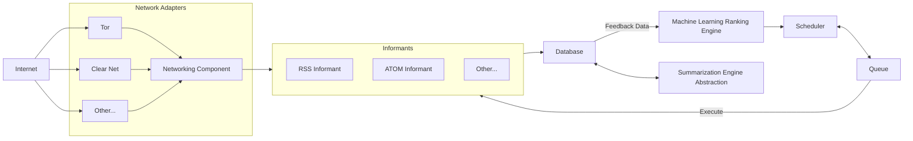
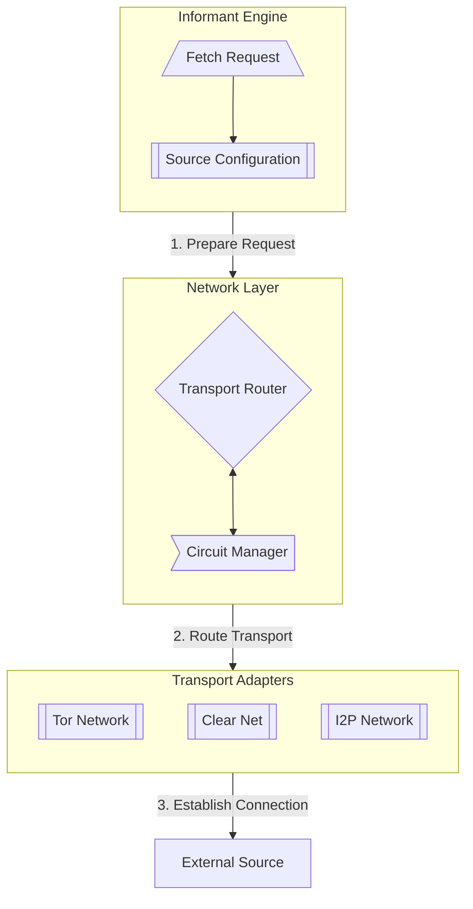
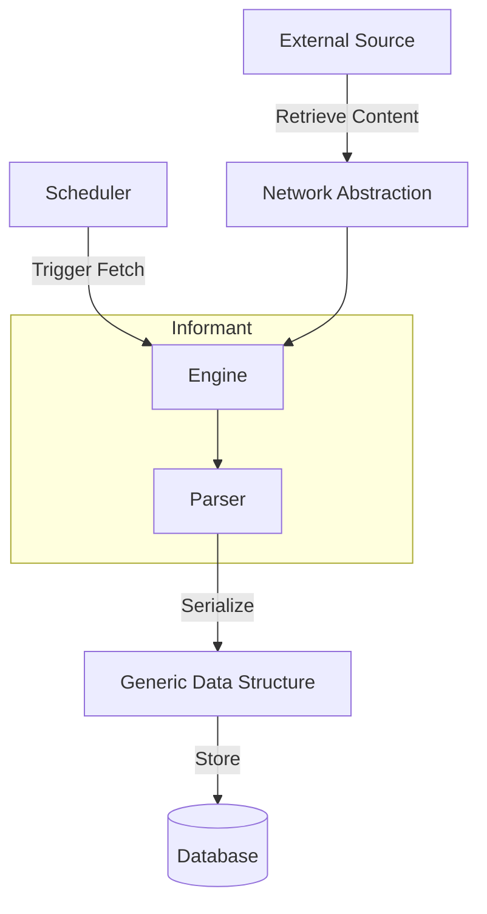
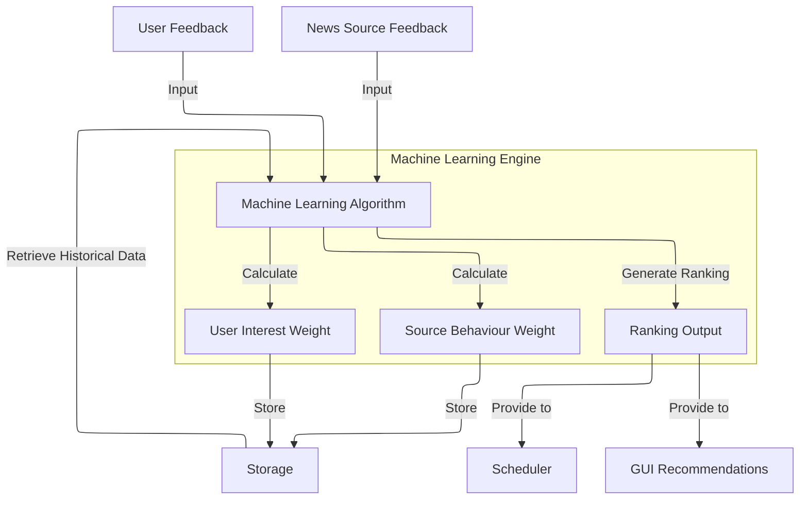
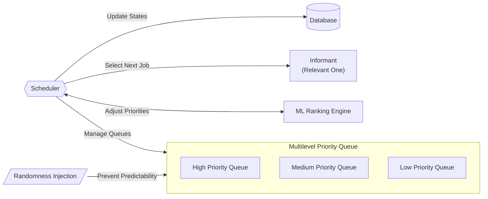
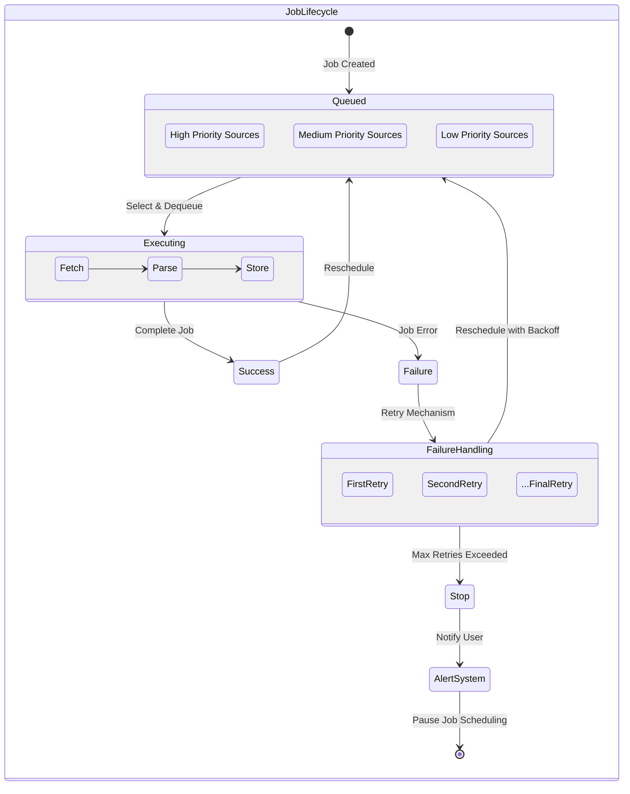

# Architecture

## System Overview

```mermaid
flowchart LR
    NetworkLayer["Networking Component"]

    subgraph NetworkAdapters[Network Adapters]
        TorAdapter[Tor] --> NetworkLayer
        InternetAdapter[Clear Net] --> NetworkLayer
        OtherAdapter[Other...] --> NetworkLayer
    end
    Internet --> TorAdapter
    Internet --> InternetAdapter
    Internet --> OtherAdapter

    subgraph Informants
        RSSInformant["RSS Informant"]
        ATOMInformant["ATOM Informant"]
        OtherInformant["Other..."]
    end

    Scheduler <--> Queue
    NetworkLayer --> Informants
    MLRanker["Machine Learning Ranking Engine"] --> Scheduler
    Database -->|Feedback Data| MLRanker
    Informants --> Database
    Queue -->|Execute| Informants
    Database <--> LLM["Summarization Engine Abstraction"]
```

### Network Abstraction Design

```mermaid
graph TD
    subgraph InformantEngine["Informant Engine"]
        direction TB
        RequestShape[/Fetch Request\]
        ConfigShape[[Source Configuration]]
        RequestShape --> ConfigShape
    end

    subgraph NetworkLayer["Network Layer"]
        direction TB
        RouterShape{Transport Router}
        CircuitShape>Circuit Manager]
        RouterShape <--> CircuitShape
    end

    subgraph NetworkTransports["Transport Adapters"]
        direction TB
        TorTransport[[Tor Network]]
        ClearNetTransport[[Clear Net]]
        I2PTransport[[I2P Network]]
    end

    InformantEngine -->|1. Prepare Request| NetworkLayer
    NetworkLayer -->|2. Route Transport| NetworkTransports
    NetworkTransports -->|3. Establish Connection| ExternalSource["External Source"]
```

### Informants Design

```mermaid
graph TD
    A[Scheduler] -->|Trigger Fetch| B[Engine]
    C[Network Abstraction] --> B
    D[External Source] -->|Retrieve Content| C
    B --> E[Parser]
    E -->|Serialize| F[Generic Data Structure]
    F -->|Store| G[(Database)]

    subgraph Informant
        B
        E
    end
```

### Machine Learning Ranking Engine Design

```mermaid
%%{init: { 'flowchart': { 'defaultRenderer': 'elk' }}}%%

graph TD
    A[Storage] -->|Retrieve Historical Data| B[Machine Learning Algorithm]
    C[User Feedback] -->|Input| B
    I[News Source Feedback] -->|Input| B
    B -->|Calculate| D[Source Behaviour Weight]
    B -->|Calculate| E[User Interest Weight]
    D -->|Store| A
    E -->|Store| A
    B -->|Generate Ranking| F[Ranking Output]
    F -->|Provide to| G[Scheduler]
    F -->|Provide to| H[GUI Recommendations]

    subgraph Machine Learning Engine
        B
        D
        E
        F
    end
```

### Scheduler Design

```mermaid
graph LR
    Scheduler{{"Scheduler"}}

    subgraph MultiLevelQueue["Multilevel Priority Queue"]
        direction TB
        HighPriorityQueue["High Priority Queue"]
        MediumPriorityQueue["Medium Priority Queue"]
        LowPriorityQueue["Low Priority Queue"]
    end

    RandomnessInjection[/"Randomness Injection"/]

    Scheduler --> |Manage Queues| MultiLevelQueue
    RandomnessInjection --> |Prevent Predictability| MultiLevelQueue

    MLRanker["ML Ranking Engine"]
    Database[("Database")]
    Informant["Informant<br/>(Relevant One)"]

    Scheduler --> |Update States| Database
    Scheduler --> |Select Next Job| Informant
    Scheduler <--> |Adjust Priorities| MLRanker
```

```mermaid
stateDiagram-v2
    direction TB

    state JobLifecycle {
        [*] --> Queued : Job Created

        state Queued {
            direction TB
            HighPriority: High Priority Sources
            MediumPriority: Medium Priority Sources
            LowPriority: Low Priority Sources
        }

        Queued --> Executing : Select & Dequeue

        state Executing {
            direction LR
            Fetch --> Parse
            Parse --> Store
        }

        Executing --> Success : Complete Job
        Executing --> Failure : Job Error

        Success --> Queued : Reschedule

        state FailureHandling {
            direction TB
            FirstRetry
            SecondRetry
            ...FinalRetry
        }

        Failure --> FailureHandling : Retry Mechanism

        FailureHandling --> Queued : Reschedule with Backoff
        FailureHandling --> Stop : Max Retries Exceeded

        Stop --> AlertSystem : Notify User
        AlertSystem --> [*] : Pause Job Scheduling
    }
```
